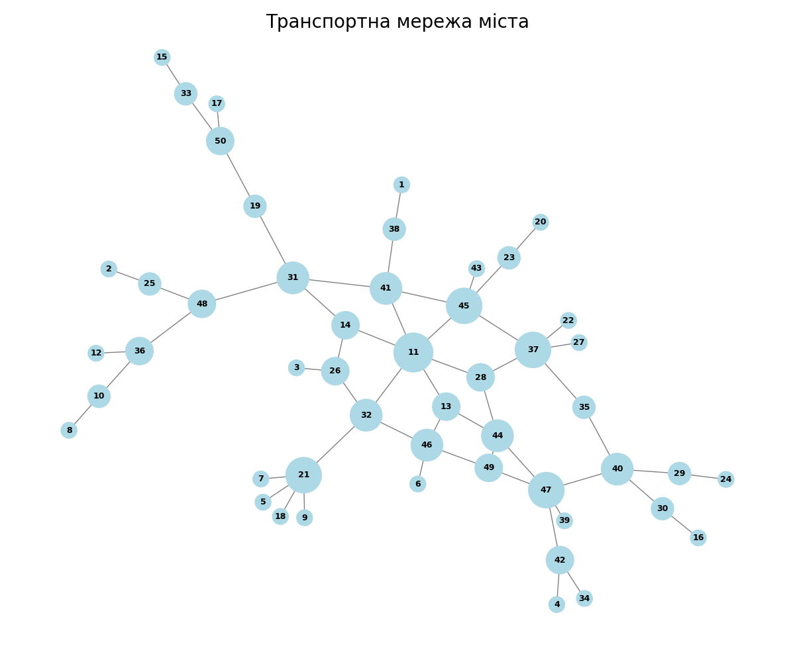
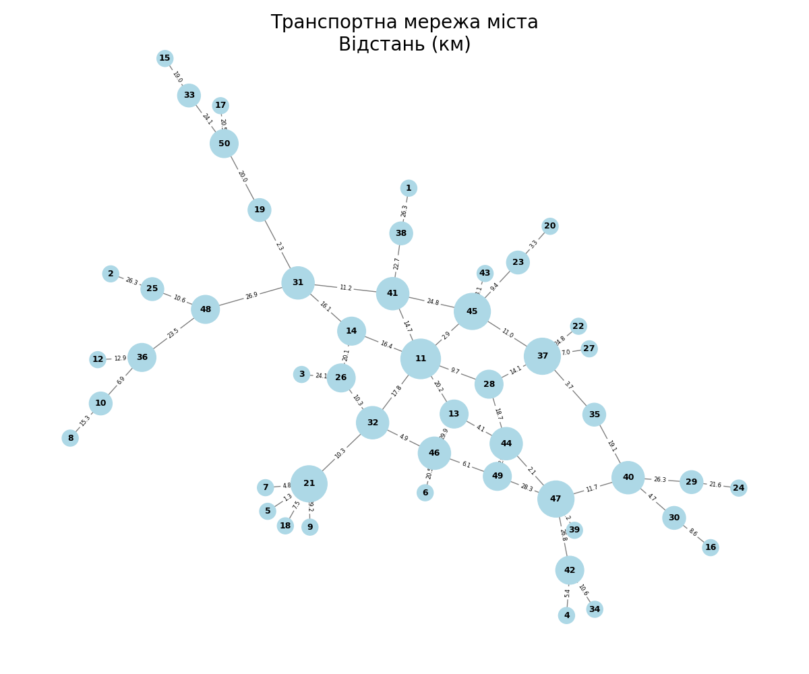
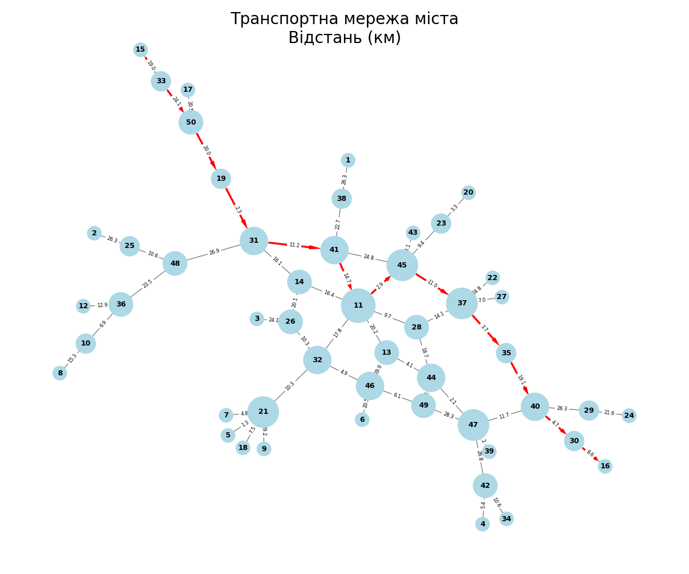

# Завдання 1

## Загальні характеристики графа

Для моделювання транспортної мережі було створено граф, що відображає взаємозв'язки між станціями. Нижче наведено основні характеристики цього графа, які допоможуть зрозуміти його структуру та функціонування.

| **Показник**                       | **Значення** |
| ---------------------------------- | ------------ |
| Кількість станцій (Вершин)         | 50           |
| Кількість з'єднань (Ребер)         | 58           |
| Середній ступінь                   | 2.32         |
| Кількість зв'язаних компонент      | 1            |
| Діаметр графа                      | 11           |
| Середня довжина найкоротшого шляху | 5.02         |

## Кількість вершин за ступенем

Розподіл ступенів станцій у графі може вказувати на їхню важливість у транспортній мережі. Нижче представлено таблицю, що демонструє, скільки станцій має кожен ступінь:

| **Ступінь** | **Кількість вершин** |
| ----------- | -------------------- |
| 1           | 21                   |
| 2           | 9                    |
| 3           | 9                    |
| 4           | 6                    |
| 5           | 4                    |
| 6           | 1                    |

## Основні характеристики графа

- **Кількість станцій (вершин):** 50  
  Граф містить 50 станцій, що свідчить про достатньо велику транспортну мережу.

- **Кількість з'єднань (ребер):** 58  
  Кількість ребер перевищує кількість вершин, що свідчить про те, що граф є більш зв'язним. Кожна станція, в середньому, має близько 2.32 з'єднання.

- **Розподіл ступенів:**  
  Більшість станцій мають 1 або 2 з'єднання (21 станція з 1 ребром і 9 станцій з 2 ребрами). Однак присутність станцій з вищими ступенями (3, 4, 5, 6) свідчить про те, що деякі станції виконують важливі функції в мережі. Наприклад, одна станція має 6 з'єднань, що вказує на її роль як важливого хабу.

- **Кількість зв'язаних компонент:** 1  
  Це означає, що весь граф є зв'язним, тобто між будь-якими двома станціями можна знайти шлях.

- **Діаметр графа:** 11  
  Це вказує на максимальну відстань між найбільш віддаленими станціями. Менший діаметр вказує на те, що станції є більш доступними одна для одної.

- **Середня довжина найкоротшого шляху:** 5.02  
  Середня довжина найкоротшого шляху між станціями вказує на те, що, в середньому, потрібно подолати близько 5 ребер для переходу з однієї станції на іншу. Це свідчить про відносно високу доступність у мережі.

## Висновки та рекомендації

На основі проведеного аналізу графа можна зробити кілька висновків і рекомендацій:

- **Необхідність поліпшення з'єднань:**  
  Багато станцій мають лише одне або два з'єднання, що може ускладнити переміщення пасажирів. Розгляд можливості додавання нових з'єднань між станціями з низьким ступенем може покращити доступність.

- **Створення хабів:**  
  Ключові станції з вищим ступенем можуть бути використані для організації вузлових точок, де пасажири можуть легко переходити між різними маршрутами. Підтримка та розвиток таких станцій можуть позитивно вплинути на всю мережу.

- **Дослідження потоку пасажирів:**  
  Варто проаналізувати, як користувачі взаємодіють із мережею, щоб зрозуміти, чи використовують вони станції з низьким ступенем. Це може допомогти в плануванні подальших покращень.

- **Покращення середньої довжини шляху:**  
  Можливо, варто оптимізувати маршрути для зменшення середньої довжини найкоротшого шляху, що може зменшити час подорожі для пасажирів.

- **Аналіз ризиків:**  
  З огляду на діаметр графа, важливо також розглянути питання потенційних ризиків, пов'язаних із доступністю станцій, які можуть опинитися в ізоляції в разі непередбачуваних обставин (наприклад, аварії або закриття частин мережі).

# Завдання 2

## Порівняння алгоритмів DFS і BFS

У даному завданні були реалізовані два популярні алгоритми для обходу графа — **глибини (DFS)** та **ширини (BFS)**. Обидва алгоритми використовуються для пошуку шляхів у графах, але вони працюють за різними принципами. Розглянемо отримані результати для графа з ребрами, зазначеними нижче:

### Отримані шляхи

- **DFS шлях з 15 до 16:**

`['15', '33', '50', '19', '31', '41', '45', '37', '28', '44', '13', '46', '49', '47', '40', '30', '16']`

- **BFS шлях з 15 до 16:**

`['15', '33', '50', '19', '31', '41', '45', '37', '35', '40', '30', '16']`

### Аналіз шляхів

#### Алгоритм глибини (DFS)

DFS працює за принципом "вглиб", досліджуючи максимально можливі шляхи від початкової вершини перед тим, як повернутися назад. Це означає, що він може пройти через всі можливі шляхи до певної глибини, перш ніж перейти до інших варіантів. Отриманий шлях для DFS є досить довгим і включає багато проміжних станцій, що свідчить про те, що алгоритм намагався вичерпно дослідити граф, перш ніж знайти шлях до цільової станції.

#### Алгоритм ширини (BFS)

BFS працює за принципом "вшир", досліджуючи всі сусідні вершини на поточному рівні, перш ніж перейти на наступний. Отриманий шлях для BFS є коротшим, що вказує на те, що алгоритм знаходить шлях до цільової станції, рухаючись від найближчих станцій, без детального вивчення всіх можливих шляхів. Таким чином, BFS часто швидше знаходить найкоротший шлях в графах, оскільки він не вичерпує всі можливості, як це робить DFS.

### Порівняння результатів

- **Довжина шляху:**  
  DFS генерує довший шлях, який може включати багато непотрібних станцій, в той час як BFS пропонує коротший і більш оптимізований шлях до мети.

- **Структура шляху:**  
  Шлях, знайдений за допомогою DFS, показує більше проміжних станцій, які не є необхідними для досягнення цілі. BFS, навпаки, обирає найбільш прямий шлях.

### Висновки

1. **Ефективність:**  
   BFS є більш ефективним для пошуку найкоротшого шляху в графах, тоді як DFS може бути корисним для вивчення структури графа або для знаходження всіх можливих шляхів.

2. **Використання:**  
   Вибір між DFS і BFS залежить від конкретних потреб задачі. Якщо необхідно знайти найкоротший шлях, краще використовувати BFS. Якщо ж потрібно вивчити всі можливі шляхи, тоді DFS може бути кращим варіантом.

3. **Контекст:**  
   Для реальних застосувань у транспортних мережах важливо враховувати не лише наявність шляхів, а й їхню довжину. Це може вплинути на рішення щодо маршрутів та організації трафіку.

# Завдання 3

## Додавання ваг до графа транспортної мережі

У даному завданні було вдосконалено граф транспортної мережі, додавши ваги відстані та часу для кожного з'єднання. Крім того, за допомогою коефіцієнтів 0.4 для відстані та 0.6 для часу була розрахована третя вага — оптимізована. Вибір таких коефіцієнтів є результатом компромісу між мінімізацією часу в дорозі та зменшенням загальних витрат на перевезення.

В результаті було отримано наступні графи:

1. **Граф з вагами (Відстань)**
   

2. **Граф з вагами (Час)**
   

3. **Граф з оптимізованими вагами**
   

### Алгоритм Дейкстри

З використанням алгоритму Дейкстри були отримані найкоротші шляхи від вершини 15 до кожної з інших вершин графу по кожній з ваг:

| Вершина | Найкоротша відстань | Шлях за відстанню                                                          | Найкоротший час | Шлях за часом                                                              | Сумарна оптимізована вага | Шлях за оптимізованою вагою                                                  |
| ------- | ------------------- | -------------------------------------------------------------------------- | --------------- | -------------------------------------------------------------------------- | ------------------------- | ---------------------------------------------------------------------------- |
| 1       | 125.6               | 15 -> 33 -> 50 -> 19 -> 31 -> 41 -> 38 -> 1                                | 14.7            | 15 -> 33 -> 50 -> 19 -> 31 -> 41 -> 38 -> 1                                | 59.06                     | 15 -> 33 -> 50 -> 19 -> 31 -> 41 -> 38 -> 1 1                                |
| 2       | 129.2               | 15 -> 33 -> 50 -> 19 -> 31 -> 48 -> 25 -> 2                                | 11.1            | 15 -> 33 -> 50 -> 19 -> 31 -> 48 -> 25 -> 2                                | 58.34                     | 15 -> 33 -> 50 -> 19 -> 31 -> 48 -> 25 -> 2 1                                |
| 3       | 125.7               | 15 -> 33 -> 50 -> 19 -> 31 -> 14 -> 26 -> 3                                | 16.1            | 15 -> 33 -> 50 -> 19 -> 31 -> 14 -> 26 -> 3                                | 59.94                     | 15 -> 33 -> 50 -> 19 -> 31 -> 14 -> 26 -> 3 1                                |
| 4       | 149.9               | 15 -> 33 -> 50 -> 19 -> 31 -> 41 -> 11 -> 13 -> 44 -> 47 -> 42 -> 4        | 20.7            | 15 -> 33 -> 50 -> 19 -> 31 -> 41 -> 11 -> 28 -> 44 -> 47 -> 42 -> 4        | 73.4                      | 15 -> 33 -> 50 -> 19 -> 31 -> 41 -> 11 -> 13 -> 44 -> 47 -> 42 -> 4 1        |
| 5       | 120.7               | 15 -> 33 -> 50 -> 19 -> 31 -> 41 -> 11 -> 32 -> 21 -> 5                    | 17.4            | 15 -> 33 -> 50 -> 19 -> 31 -> 14 -> 26 -> 32 -> 21 -> 5                    | 58.84                     | 15 -> 33 -> 50 -> 19 -> 31 -> 41 -> 11 -> 32 -> 21 -> 5 1                    |
| 6       | 134.5               | 15 -> 33 -> 50 -> 19 -> 31 -> 41 -> 11 -> 32 -> 46 -> 6                    | 17.6            | 15 -> 33 -> 50 -> 19 -> 31 -> 41 -> 11 -> 13 -> 46 -> 6                    | 64.78                     | 15 -> 33 -> 50 -> 19 -> 31 -> 41 -> 11 -> 32 -> 46 -> 6 1                    |
| 7       | 124.2               | 15 -> 33 -> 50 -> 19 -> 31 -> 41 -> 11 -> 32 -> 21 -> 7                    | 20              | 15 -> 33 -> 50 -> 19 -> 31 -> 14 -> 26 -> 32 -> 21 -> 7                    | 61.8                      | 15 -> 33 -> 50 -> 19 -> 31 -> 41 -> 11 -> 32 -> 21 -> 7 1                    |
| 8       | 138                 | 15 -> 33 -> 50 -> 19 -> 31 -> 48 -> 36 -> 10 -> 8                          | 17.4            | 15 -> 33 -> 50 -> 19 -> 31 -> 48 -> 36 -> 10 -> 8                          | 65.64                     | 15 -> 33 -> 50 -> 19 -> 31 -> 48 -> 36 -> 10 -> 8 1                          |
| 9       | 148.6               | 15 -> 33 -> 50 -> 19 -> 31 -> 41 -> 11 -> 32 -> 21 -> 9                    | 19.2            | 15 -> 33 -> 50 -> 19 -> 31 -> 14 -> 26 -> 32 -> 21 -> 9                    | 71.08                     | 15 -> 33 -> 50 -> 19 -> 31 -> 41 -> 11 -> 32 -> 21 -> 9 1                    |
| 10      | 122.7               | 15 -> 33 -> 50 -> 19 -> 31 -> 48 -> 36 -> 10                               | 14.1            | 15 -> 33 -> 50 -> 19 -> 31 -> 48 -> 36 -> 10                               | 57.54                     | 15 -> 33 -> 50 -> 19 -> 31 -> 48 -> 36 -> 10 1                               |
| 11      | 91.3                | 15 -> 33 -> 50 -> 19 -> 31 -> 41 -> 11                                     | 10.4            | 15 -> 33 -> 50 -> 19 -> 31 -> 41 -> 11                                     | 42.76                     | 15 -> 33 -> 50 -> 19 -> 31 -> 41 -> 11 1                                     |
| 12      | 128.7               | 15 -> 33 -> 50 -> 19 -> 31 -> 48 -> 36 -> 12                               | 12.9            | 15 -> 33 -> 50 -> 19 -> 31 -> 48 -> 36 -> 12                               | 59.22                     | 15 -> 33 -> 50 -> 19 -> 31 -> 48 -> 36 -> 12 1                               |
| 13      | 111.5               | 15 -> 33 -> 50 -> 19 -> 31 -> 41 -> 11 -> 13                               | 13.2            | 15 -> 33 -> 50 -> 19 -> 31 -> 41 -> 11 -> 13                               | 52.52                     | 15 -> 33 -> 50 -> 19 -> 31 -> 41 -> 11 -> 13 1                               |
| 14      | 81.5                | 15 -> 33 -> 50 -> 19 -> 31 -> 14                                           | 9.9             | 15 -> 33 -> 50 -> 19 -> 31 -> 14                                           | 38.54                     | 15 -> 33 -> 50 -> 19 -> 31 -> 14 1                                           |
| 15      | 0                   | 15                                                                         | 0               | 15                                                                         | 0                         | 15 1                                                                         |
| 16      | 141.3               | 15 -> 33 -> 50 -> 19 -> 31 -> 41 -> 11 -> 45 -> 37 -> 35 -> 40 -> 30 -> 16 | 23.1            | 15 -> 33 -> 50 -> 19 -> 31 -> 41 -> 11 -> 28 -> 44 -> 47 -> 40 -> 30 -> 16 | 71.96                     | 15 -> 33 -> 50 -> 19 -> 31 -> 41 -> 11 -> 13 -> 44 -> 47 -> 40 -> 30 -> 16 1 |
| 17      | 63.6                | 15 -> 33 -> 50 -> 17                                                       | 4.9             | 15 -> 33 -> 50 -> 17                                                       | 28.38                     | 15 -> 33 -> 50 -> 17 1                                                       |
| 18      | 126.9               | 15 -> 33 -> 50 -> 19 -> 31 -> 41 -> 11 -> 32 -> 21 -> 18                   | 18.9            | 15 -> 33 -> 50 -> 19 -> 31 -> 14 -> 26 -> 32 -> 21 -> 18                   | 62.22                     | 15 -> 33 -> 50 -> 19 -> 31 -> 41 -> 11 -> 32 -> 21 -> 18 1                   |
| 19      | 63.1                | 15 -> 33 -> 50 -> 19                                                       | 5               | 15 -> 33 -> 50 -> 19                                                       | 28.24                     | 15 -> 33 -> 50 -> 19 1                                                       |
| 20      | 106.9               | 15 -> 33 -> 50 -> 19 -> 31 -> 41 -> 11 -> 45 -> 23 -> 20                   | 16.8            | 15 -> 33 -> 50 -> 19 -> 31 -> 41 -> 45 -> 23 -> 20                         | 54.64                     | 15 -> 33 -> 50 -> 19 -> 31 -> 41 -> 11 -> 45 -> 23 -> 20 1                   |
| 21      | 119.4               | 15 -> 33 -> 50 -> 19 -> 31 -> 41 -> 11 -> 32 -> 21                         | 16.1            | 15 -> 33 -> 50 -> 19 -> 31 -> 14 -> 26 -> 32 -> 21                         | 57.54                     | 15 -> 33 -> 50 -> 19 -> 31 -> 41 -> 11 -> 32 -> 21 1                         |
| 22      | 130                 | 15 -> 33 -> 50 -> 19 -> 31 -> 41 -> 11 -> 45 -> 37 -> 22                   | 15.7            | 15 -> 33 -> 50 -> 19 -> 31 -> 41 -> 11 -> 28 -> 37 -> 22                   | 63.58                     | 15 -> 33 -> 50 -> 19 -> 31 -> 41 -> 11 -> 45 -> 37 -> 22 1                   |
| 23      | 103.6               | 15 -> 33 -> 50 -> 19 -> 31 -> 41 -> 11 -> 45 -> 23                         | 13.9            | 15 -> 33 -> 50 -> 19 -> 31 -> 41 -> 45 -> 23                               | 51.58                     | 15 -> 33 -> 50 -> 19 -> 31 -> 41 -> 11 -> 45 -> 23 1                         |
| 24      | 175.9               | 15 -> 33 -> 50 -> 19 -> 31 -> 41 -> 11 -> 45 -> 37 -> 35 -> 40 -> 29 -> 24 | 22.3            | 15 -> 33 -> 50 -> 19 -> 31 -> 41 -> 11 -> 28 -> 44 -> 47 -> 40 -> 29 -> 24 | 85.32                     | 15 -> 33 -> 50 -> 19 -> 31 -> 41 -> 11 -> 13 -> 44 -> 47 -> 40 -> 29 -> 24 1 |
| 25      | 102.9               | 15 -> 33 -> 50 -> 19 -> 31 -> 48 -> 25                                     | 8.9             | 15 -> 33 -> 50 -> 19 -> 31 -> 48 -> 25                                     | 46.5                      | 15 -> 33 -> 50 -> 19 -> 31 -> 48 -> 25 1                                     |
| 26      | 101.6               | 15 -> 33 -> 50 -> 19 -> 31 -> 14 -> 26                                     | 12.2            | 15 -> 33 -> 50 -> 19 -> 31 -> 14 -> 26                                     | 47.96                     | 15 -> 33 -> 50 -> 19 -> 31 -> 14 -> 26 1                                     |
| 27      | 112.2               | 15 -> 33 -> 50 -> 19 -> 31 -> 41 -> 11 -> 45 -> 37 -> 27                   | 16.5            | 15 -> 33 -> 50 -> 19 -> 31 -> 41 -> 11 -> 28 -> 37 -> 27                   | 56.94                     | 15 -> 33 -> 50 -> 19 -> 31 -> 41 -> 11 -> 45 -> 37 -> 27 1                   |
| 28      | 101                 | 15 -> 33 -> 50 -> 19 -> 31 -> 41 -> 11 -> 28                               | 12              | 15 -> 33 -> 50 -> 19 -> 31 -> 41 -> 11 -> 28                               | 47.6                      | 15 -> 33 -> 50 -> 19 -> 31 -> 41 -> 11 -> 28 1                               |
| 29      | 154.3               | 15 -> 33 -> 50 -> 19 -> 31 -> 41 -> 11 -> 45 -> 37 -> 35 -> 40 -> 29       | 19.5            | 15 -> 33 -> 50 -> 19 -> 31 -> 41 -> 11 -> 28 -> 44 -> 47 -> 40 -> 29       | 75                        | 15 -> 33 -> 50 -> 19 -> 31 -> 41 -> 11 -> 13 -> 44 -> 47 -> 40 -> 29 1       |
| 30      | 132.7               | 15 -> 33 -> 50 -> 19 -> 31 -> 41 -> 11 -> 45 -> 37 -> 35 -> 40 -> 30       | 19.6            | 15 -> 33 -> 50 -> 19 -> 31 -> 41 -> 11 -> 28 -> 44 -> 47 -> 40 -> 30       | 66.42                     | 15 -> 33 -> 50 -> 19 -> 31 -> 41 -> 11 -> 13 -> 44 -> 47 -> 40 -> 30 1       |
| 31      | 65.4                | 15 -> 33 -> 50 -> 19 -> 31                                                 | 6.2             | 15 -> 33 -> 50 -> 19 -> 31                                                 | 29.88                     | 15 -> 33 -> 50 -> 19 -> 31 1                                                 |
| 32      | 109.1               | 15 -> 33 -> 50 -> 19 -> 31 -> 41 -> 11 -> 32                               | 13.3            | 15 -> 33 -> 50 -> 19 -> 31 -> 14 -> 26 -> 32                               | 51.74                     | 15 -> 33 -> 50 -> 19 -> 31 -> 41 -> 11 -> 32 1                               |
| 33      | 19                  | 15 -> 33                                                                   | 1.7             | 15 -> 33                                                                   | 8.62                      | 15 -> 33 1                                                                   |
| 34      | 155.1               | 15 -> 33 -> 50 -> 19 -> 31 -> 41 -> 11 -> 13 -> 44 -> 47 -> 42 -> 34       | 21.5            | 15 -> 33 -> 50 -> 19 -> 31 -> 41 -> 11 -> 28 -> 44 -> 47 -> 42 -> 34       | 75.96                     | 15 -> 33 -> 50 -> 19 -> 31 -> 41 -> 11 -> 13 -> 44 -> 47 -> 42 -> 34 1       |
| 35      | 108.9               | 15 -> 33 -> 50 -> 19 -> 31 -> 41 -> 11 -> 45 -> 37 -> 35                   | 14.8            | 15 -> 33 -> 50 -> 19 -> 31 -> 41 -> 11 -> 28 -> 37 -> 35                   | 54.6                      | 15 -> 33 -> 50 -> 19 -> 31 -> 41 -> 11 -> 45 -> 37 -> 35 1                   |
| 36      | 115.8               | 15 -> 33 -> 50 -> 19 -> 31 -> 48 -> 36                                     | 11.2            | 15 -> 33 -> 50 -> 19 -> 31 -> 48 -> 36                                     | 53.04                     | 15 -> 33 -> 50 -> 19 -> 31 -> 48 -> 36 1                                     |
| 37      | 105.2               | 15 -> 33 -> 50 -> 19 -> 31 -> 41 -> 11 -> 45 -> 37                         | 13.7            | 15 -> 33 -> 50 -> 19 -> 31 -> 41 -> 11 -> 28 -> 37                         | 52.46                     | 15 -> 33 -> 50 -> 19 -> 31 -> 41 -> 11 -> 45 -> 37 1                         |
| 38      | 99.3                | 15 -> 33 -> 50 -> 19 -> 31 -> 41 -> 38                                     | 10.9            | 15 -> 33 -> 50 -> 19 -> 31 -> 41 -> 38                                     | 46.26                     | 15 -> 33 -> 50 -> 19 -> 31 -> 41 -> 38 1                                     |
| 39      | 138.9               | 15 -> 33 -> 50 -> 19 -> 31 -> 41 -> 11 -> 13 -> 44 -> 47 -> 39             | 18              | 15 -> 33 -> 50 -> 19 -> 31 -> 41 -> 11 -> 28 -> 44 -> 47 -> 39             | 67.38                     | 15 -> 33 -> 50 -> 19 -> 31 -> 41 -> 11 -> 13 -> 44 -> 47 -> 39 1             |
| 40      | 128                 | 15 -> 33 -> 50 -> 19 -> 31 -> 41 -> 11 -> 45 -> 37 -> 35 -> 40             | 16.6            | 15 -> 33 -> 50 -> 19 -> 31 -> 41 -> 11 -> 28 -> 44 -> 47 -> 40             | 62.74                     | 15 -> 33 -> 50 -> 19 -> 31 -> 41 -> 11 -> 13 -> 44 -> 47 -> 40 1             |
| 41      | 76.6                | 15 -> 33 -> 50 -> 19 -> 31 -> 41                                           | 9.2             | 15 -> 33 -> 50 -> 19 -> 31 -> 41                                           | 36.16                     | 15 -> 33 -> 50 -> 19 -> 31 -> 41 1                                           |
| 42      | 144.5               | 15 -> 33 -> 50 -> 19 -> 31 -> 41 -> 11 -> 13 -> 44 -> 47 -> 42             | 18.2            | 15 -> 33 -> 50 -> 19 -> 31 -> 41 -> 11 -> 28 -> 44 -> 47 -> 42             | 69.74                     | 15 -> 33 -> 50 -> 19 -> 31 -> 41 -> 11 -> 13 -> 44 -> 47 -> 42 1             |
| 43      | 117.3               | 15 -> 33 -> 50 -> 19 -> 31 -> 41 -> 11 -> 45 -> 43                         | 13.4            | 15 -> 33 -> 50 -> 19 -> 31 -> 41 -> 45 -> 43                               | 56.76                     | 15 -> 33 -> 50 -> 19 -> 31 -> 41 -> 11 -> 45 -> 43 1                         |
| 44      | 115.6               | 15 -> 33 -> 50 -> 19 -> 31 -> 41 -> 11 -> 13 -> 44                         | 13.2            | 15 -> 33 -> 50 -> 19 -> 31 -> 41 -> 11 -> 28 -> 44                         | 55.18                     | 15 -> 33 -> 50 -> 19 -> 31 -> 41 -> 11 -> 13 -> 44 1                         |
| 45      | 94.2                | 15 -> 33 -> 50 -> 19 -> 31 -> 41 -> 11 -> 45                               | 11.3            | 15 -> 33 -> 50 -> 19 -> 31 -> 41 -> 45                                     | 46.26                     | 15 -> 33 -> 50 -> 19 -> 31 -> 41 -> 11 -> 45 1                               |
| 46      | 114                 | 15 -> 33 -> 50 -> 19 -> 31 -> 41 -> 11 -> 32 -> 46                         | 14.3            | 15 -> 33 -> 50 -> 19 -> 31 -> 41 -> 11 -> 13 -> 46                         | 54.6                      | 15 -> 33 -> 50 -> 19 -> 31 -> 41 -> 11 -> 32 -> 46 1                         |
| 47      | 117.7               | 15 -> 33 -> 50 -> 19 -> 31 -> 41 -> 11 -> 13 -> 44 -> 47                   | 15.1            | 15 -> 33 -> 50 -> 19 -> 31 -> 41 -> 11 -> 28 -> 44 -> 47                   | 57.16                     | 15 -> 33 -> 50 -> 19 -> 31 -> 41 -> 11 -> 13 -> 44 -> 47 1                   |
| 48      | 92.3                | 15 -> 33 -> 50 -> 19 -> 31 -> 48                                           | 7.7             | 15 -> 33 -> 50 -> 19 -> 31 -> 48                                           | 41.54                     | 15 -> 33 -> 50 -> 19 -> 31 -> 48 1                                           |
| 49      | 117.6               | 15 -> 33 -> 50 -> 19 -> 31 -> 41 -> 11 -> 13 -> 44 -> 49                   | 15.5            | 15 -> 33 -> 50 -> 19 -> 31 -> 41 -> 11 -> 13 -> 46 -> 49                   | 57.76                     | 15 -> 33 -> 50 -> 19 -> 31 -> 41 -> 11 -> 32 -> 46 -> 49 1                   |
| 50      | 43.1                | 15 -> 33 -> 50                                                             | 3               | 15 -> 33 -> 50                                                             | 19.04                     | 15 -> 33 -> 50 1                                                             |

Для подальшого аналізу було вибрано шляхи по трьом вагам з вершини 15 до вершини 16.

- **Відстань:**

  - **Вершина 16:** відстань = 141.30
  - **Шлях:** `15 -> 33 -> 50 -> 19 -> 31 -> 41 -> 11 -> 45 -> 37 -> 35 -> 40 -> 30 -> 16`

- **Час:**

  - **Вершина 16:** час = 23.10
  - **Шлях:** `15 -> 33 -> 50 -> 19 -> 31 -> 41 -> 11 -> 28 -> 44 -> 47 -> 40 -> 30 -> 16`

- **Оптимізована вага:**
  - **Вершина 16:** сумарна оптимізована вага = 71.96
  - **Шлях:** `15 -> 33 -> 50 -> 19 -> 31 -> 41 -> 11 -> 13 -> 44 -> 47 -> 40 -> 30 -> 16`

1. **Граф з вагами (Відстань) та найкоротшим шляхом з вершини 15 до 16**
   

2. **Граф з вагами (Час) та найкоротшим шляхом з вершини 15 до 16**
   

3. **Граф з оптимізованими вагами та найкоротшим шляхом з вершини 15 до 16**
   

### Порівняння отриманих шляхів

| **Показник** | **Шлях (Відстань)**                                                        | **Шлях (Час)**                                                             | **Шлях (Оптимізований)**                                                   |
| ------------ | -------------------------------------------------------------------------- | -------------------------------------------------------------------------- | -------------------------------------------------------------------------- |
| **Відстань** | 141.3                                                                      | 146.8                                                                      | 142.7                                                                      |
| **Час**      | 27.1                                                                       | 23.1                                                                       | 24.8                                                                       |
| **Шлях**     | 15 -> 33 -> 50 -> 19 -> 31 -> 41 -> 11 -> 45 -> 37 -> 35 -> 40 -> 30 -> 16 | 15 -> 33 -> 50 -> 19 -> 31 -> 41 -> 11 -> 28 -> 44 -> 47 -> 40 -> 30 -> 16 | 15 -> 33 -> 50 -> 19 -> 31 -> 41 -> 11 -> 13 -> 44 -> 47 -> 40 -> 30 -> 16 |

#### Аналіз шляхів

- **Шлях з вагою відстані** є найкоротшим, але не обов'язково є найшвидшим, оскільки враховує лише відстань, а не час, необхідний для проходження маршруту.
- **Шлях з вагою часу** є значно коротшим у часі, що свідчить про його ефективність для пасажирів, оскільки час є критично важливим у транспортних мережах.

- **Оптимізований шлях** пропонує компроміс між відстанню та часом, обираючи маршрути, які враховують обидва фактори, завдяки чому отримано зважений результат.

### Висновки

1. **Ефективність маршрутів:**

   - Шлях, оптимізований з урахуванням як відстані, так і часу, показує, що варто враховувати обидва показники при плануванні маршрутів у транспортних мережах. Це допомагає знайти найзручніші і найшвидші шляхи для пасажирів.

2. **Важливість балансування:**

   - Необхідно шукати баланс між витратами часу і відстані при плануванні маршрутів, щоб максимізувати ефективність транспортної мережі. Оптимізація шляхів допомагає зменшити загальний час подорожі та підвищити задоволеність пасажирів.

3. **Подальші дослідження:**
   - Рекомендується продовжити дослідження, аналізуючи вплив інших факторів (наприклад, заторів, графіків руху) на вибір маршрутів. Це може призвести до ще більшої оптимізації транспортної системи в цілому.
